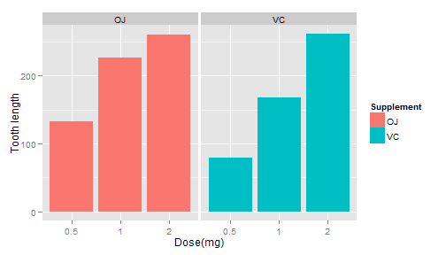

## Problem Statement :

We are going to analyze the ToothGrowth data in the R datasets package. 
We will load the ToothGrowth data and perform some basic exploratory data analyses 
Provide a basic summary of the data.
Use confidence intervals and/or hypothesis tests to compare tooth growth by supp and dose. (Only use the techniques from class, even if there's other approaches worth considering)


---

## R Code using ggplot :


```r
library(datasets)
library(ggplot2)
ggplot(data=ToothGrowth, aes(x=as.factor(dose), y=len, fill=supp)) +
    geom_bar(stat="identity",) +
    facet_grid(. ~ supp) +
    xlab("Dose(mg)") +
    ylab("Tooth length") +
    guides(fill=guide_legend(title="Supplement"))
```

 

---

## Analysis:

As can be seen above, there is a clear positive correlation between the
tooth length and the dose levels of Vitamin C, for both delivery methods.

The effect of the dose can also be identified using regression analysis. One
interesting question that can also be addressed is whether the supplement has any effect on the tooth length. In other
words, how much of the variance in tooth length, if any, can be explained by
the supplement?

---

## Conclusion :


```r
fit <- lm(len ~ dose + supp, data=ToothGrowth)
summary(fit)
```

```
## 
## Call:
## lm(formula = len ~ dose + supp, data = ToothGrowth)
## 
## Residuals:
##    Min     1Q Median     3Q    Max 
## -6.600 -3.700  0.373  2.116  8.800 
## 
## Coefficients:
##             Estimate Std. Error t value Pr(>|t|)    
## (Intercept)    9.273      1.282    7.23  1.3e-09 ***
## dose           9.764      0.877   11.14  6.3e-16 ***
## suppVC        -3.700      1.094   -3.38   0.0013 ** 
## ---
## Signif. codes:  0 '***' 0.001 '**' 0.01 '*' 0.05 '.' 0.1 ' ' 1
## 
## Residual standard error: 4.24 on 57 degrees of freedom
## Multiple R-squared:  0.704,	Adjusted R-squared:  0.693 
## F-statistic: 67.7 on 2 and 57 DF,  p-value: 8.72e-16
```

The model explains 70% of the variance in the data.
The intercept is 9.2725, meaning that with no supplement of Vitamin C, the average tooth length is 9.2725 units. The coefficient of `dose` is 9.7636. It can be interpreted as increasing the delievered dose 1 mg, all else equal (i.e. no change in the supplement type), would increase the tooth length 9.7636 units.The last coefficient is for the supplement type. Since the supplement type is a categorical variable, dummy variables are used. The computed coefficient is for `suppVC` and the value is -3.7 meaning that delivering a given dose as ascorbic acid, without changing the dose, would result in 3.7 units of decrease in the tooth length. Since there are only two categories, we can also conclude that on average, delivering the dosage as orange juice would increase the tooth length by 3.7 units.
95% confidence intervals for two variables and the intercept are as follows


```r
confint(fit)
```

```
##              2.5 % 97.5 %
## (Intercept)  6.705  11.84
## dose         8.008  11.52
## suppVC      -5.890  -1.51
```

---

## Summary:

The confidence intervals mean that if we collect a different set of data and estimate parameters of the linear model many times, 95% of the time, the coefficient estimations will be in these ranges. For each coefficient (i.e. intercept, `dose` and `suppVC`), the null hypothesis is that the coefficients are zero, meaning that no tooth length variation is explained by that variable.
All _p_-values are less than 0.05, rejecting the null hypothesis and suggesting that each variable explains a significant portion of variability in tooth length,assuming the significance level is 5%.

